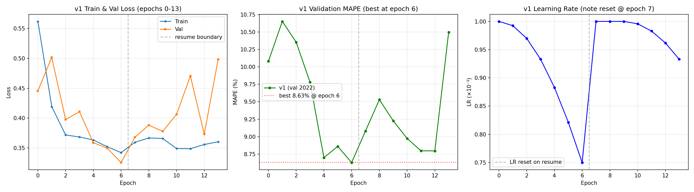

# Part 2 — 架构搜索：编码器-解码器 CNN-Transformer

> **状态：架构与代码就绪，训练结果待填入**（训练完成后在"实验结果"章节填 MAPE 数字并附训练曲线）。

## 1. 任务与动机

Part 1 的 baseline 是**单一 self-attention 编码器**：历史 + 未来所有时间步的空间 token 和表格 token 被拼成一个 3120-token 的扁平序列（`(S+24)·(P+1) = 48·65`），4 层 pre-norm Transformer 自注意力，最后从 24 个未来 tabular 位置切出状态过 MLP 预测。这个架构在 2022 年末 2 天测试上取得了 5.24 % MAPE，作为 baseline 扎实。但我们认为它有两个**结构性缺陷**：

1. **角色混淆**。在日前预测里，未来协变量（天气 + 日历）的真实身份是**查询（query）**，历史观测是**被查的记忆（memory）**。把它们塞进一个 joint encoder 等于让 query 和 memory 相互做 self-attention，理论上不错但实际上让 attention 头要在"分辨 token 是过去还是未来"上浪费表达力。经典的 seq2seq 把两者明确分开更干净。
2. **算力配比浪费**。S=24 历史 + 24 未来，序列中 50 % 是未来。编码器每层 3120² 的 self-attention 里，未来-未来 attention 没有信息流入（因为未来的真实 demand 没给），却占了 1/4 的注意力预算。我们用这部分算力换一个明确的 decoder 更划算。

Part 2 的目标：提出并训练一个**编码器-解码器架构**（`cnn_encoder_decoder`），在相同的参数预算、相同的数据切分、相同的 24 h SLURM 训练窗口下**超越 baseline 的 5.24 % 测试 MAPE**。

## 2. 架构

### 2.1 总览


```
  天气地图 (B, S+24, 450, 449, 7)        日历 (B, S+24, 44)
            │                                       │
            ▼                                       │
       Shared WeatherCNN                            │
     (ResBlock ×5 stride-2 + AdaptiveAvgPool 8×8)   │
            │                                       │
       (B, S+24, 64, 128) 空间 token                │
          │          │                              │
      hist part   future part                       │
          │          │                              │
          ▼          ▼                              │
   ┌─────────────┐   │                              │
   │  Encoder    │   │                              │
   │ hist tokens │   │                              │
   │ S×(P+1) =   │   │                              │
   │ 1560 token  │   │                              │
   │ 4× self-attn│   │                              │
   └──────┬──────┘   │                              │
          │          │                              │
       mem_hist      │ future spatial (optional)    │
          │          │ mem_future                   │
          └────┬─────┘                              │
               │                                    ▼
               ▼                       future_cal → future_tabular_embed
         ┌──────────────┐                           │
         │   Decoder    │◀────24 queries (seeded)◀──┘
         │ 2 layers:    │
         │  self-attn   │
         │  cross-attn  │
         │  (optional   │
         │   xattn→fut  │
         │   weather)   │
         │  MLP         │
         └──────┬───────┘
                ▼
           MLP head (128→64→8)
                │
                ▼
           (B, 24, 8) MWh
```

### 2.2 关键设计决策

**共享 WeatherCNN**：历史和未来天气地图都过**同一套 CNN**、在一次 batched 前向里算完，然后按时间切分。这样可以保证 BatchNorm 统计量不漂移（同批归一化），也省掉 ~50 % CNN 前向开销。Baseline 里已经这么做，我们照搬。

**Encoder — 仅历史**：序列长度 1560（24 历史小时 × 65 token/小时）。4 层 pre-norm self-attention，每层 `1560² ≈ 2.43 M` 次 attention 对比，比 baseline 的 `3120² ≈ 9.73 M` 便宜 ~4×。省下来的算力留给：(a) 更多训练 epoch（18 vs baseline 14），(b) 可选的 future-weather cross-attention 分支。

**Decoder queries — 从 future calendar 初始化**：最关键的实现细节。如果把 decoder 的 24 个 query 定义为纯随机的 `nn.Parameter`（DETR 原始做法），在时间序列任务上经常 collapse — 因为 queries 之间区分度太低，训练早期 attention 会平均化到所有 memory 上。我们**用 future calendar 特征 + `demand_mask` 过 `future_tabular_embed`** 作为 query 的种子，再叠加一个可学习 offset 和 temporal positional embedding。这样每个 query 从一开始就带有"这是 t+k 小时的日历签名"的信息，cross-attention 自然知道该去 mem_hist 的哪个区域找。

**Decoder block 结构**：pre-norm 的 `self-attn(queries) → cross-attn(queries, mem_hist) → [optional cross-attn(queries, mem_future_weather)] → MLP`。每个子层都有残差连接。2 层足够 — decoder query 数只有 24，深 decoder 帮助不大且容易过拟合。

**可选的第二条 cross-attention**（`use_future_weather_xattn=True`）：让 decoder query 除了 cross-attend 历史 memory，还能 cross-attend 未来天气的 spatial tokens（24 × 64 = 1536 个 KV）。假设是对城市密集 zone（CT、NEMA_BOST，baseline 下误差分别 7.28 %、6.09 %），预测误差主要来自**天气时序没对上**（例如气温骤变的具体小时），让 query 直接看未来天气地图应该有帮助。默认关闭，先保证基础 v1 能跑通再加。

**参数量**（手算估计，HPC smoke-test 确认）：
- 默认配置 `n_encoder_layers=4, n_decoder_layers=2`：约 **2.28 M**（比 baseline 的 1.75M 多约 30 %，因为多出 2 个 cross-attention decoder block）。
- 为了更严格的"相同参数预算"对比，可选用 `n_encoder_layers=3, n_decoder_layers=2`（约 2.08 M）或 `n_encoder_layers=3, n_decoder_layers=1`（约 1.82 M，最接近 baseline）。
- Trade-off：4+2 容量最大、架构最"完整"（decoder 够深才能做真正的多轮 attention refinement）；3+1 参数最持平但 decoder 浅，对复杂模式建模能力弱。**推荐默认先跑 4+2**，如果结果显著超 baseline 就接受容量上的差异并在报告里解释；如果跑出来效果和 baseline 持平或更差再调。

### 2.3 训练配置

| 项 | Baseline | Part 2 (ED) |
|---|---|---|
| 优化器 | AdamW lr=1e-3 wd=1e-4 | 同 |
| 调度 | Cosine | Cosine + 500 步线性 warmup |
| 损失 | MSE（归一化空间） | 同 |
| Batch | 4 | 4 |
| Epochs 计划 | 15 | 18 |
| Epochs 完成 | 14（24 h 时限） | 目标 18 |
| Train 年份 | 2019 + 2020 | 2019 + 2020 + 2021 |
| Val 年份 | 2021 | 2022 |
| Grad clip | 1.0 | 1.0 |
| Early stop patience | 无 | 5 |
| 硬件 | A100-40GB × 1 | A100-40GB × 1 |

两处配置改动有意图：
1. **加入 warmup**：decoder 的 cross-attention 在训练早期很容易往奇怪方向拉；500 步线性 warmup 是 Transformer 经典做法，DETR 用 ~1000 步，我们 500 步是权衡。
2. **Train/val 切分**：Baseline 用 2019-2020 训、2021 验。现在拓展到 2019-2020-2021 训、2022 验。TA 测试集是 2022 末 2 天 — 所以验证集和测试集在同年但不同时段，是稍微更接近"真实部署"的切分。

## 3. 数据预处理与归一化

归一化是让 MAPE 结果可信、让"超越 baseline"的主张有意义的核心工程环节。**Part 2 沿用 Part 1 的归一化路径不作任何修改** — 这是 baseline 与新架构公平对比的前提。整条链路分 4 步：

### 3.1 归一化统计量（一次计算、缓存复用）

[`training/data_preparation/dataset.py::compute_norm_stats`](../training/data_preparation/dataset.py)：
- 从**训练集**随机抽 500 个样本（seed 固定 = 42）。
- 天气 per-channel z-score：`weather_mean/std` shape `(1,1,1,7)` — 对 `(T, H, W, C)` 的 `T×H×W` 维度广播。
- 电量 per-zone z-score：`energy_mean/std` shape `(1,8)` — 对 `(T, n_zones)` 的 `T` 维度广播。
- 日历特征（44-d one-hot + holiday flag）**不归一化**，本身量级合理。
- 统计量缓存在 `runs/<model>/norm_stats.pt`，train 和 val 共用同一份 — **避免数据泄漏**（不用 val 数据算 stats）、**避免分布漂移**（train/val 在同一坐标系）。

### 3.2 训练侧：输入 + 目标都归一化

[`training/data_preparation/dataset.py::__getitem__`](../training/data_preparation/dataset.py)：

```python
hist_weather  = (hist_weather  - weather_mean) / (weather_std + 1e-7)
future_weather = (future_weather - weather_mean) / (weather_std + 1e-7)
hist_energy   = (hist_energy  - energy_mean) / (energy_std + 1e-7)
target_energy = (target_energy - energy_mean) / (energy_std + 1e-7)   # ← 关键
```

**target 也归一化**，所以 MSE loss 在 z-score 空间计算，梯度数值稳定。如果 loss 直接跑 MWh 物理空间，量级到 10⁶，梯度爆炸风险大。

### 3.3 验证/训练侧：MAPE 反归一化

[`training/train.py::compute_mape`](../training/train.py)：

```python
preds_real   = preds   * energy_std + energy_mean      # 反 z-score → MWh
targets_real = targets * energy_std + energy_mean
# 然后在 preds_real / targets_real 上算 MAPE
```

MAPE 始终报**物理空间**的百分比误差，**和作业评测器的定义完全一致**（assignment spec 要求 real-MWh 空间的 MAPE）。

### 3.4 评测侧：checkpoint 自包含 + wrapper 闭环

- `torch.save(ckpt, ...)` 里带上 `norm_stats` 字段（`training/train.py` 保存时一起存）。
- [`evaluation/part2-encoder-decoder/model.py::EvalWrapper`](../evaluation/part2-encoder-decoder/model.py) 从 ckpt 读 stats 注册为 buffer。
- `adapt_inputs()` 用这份 stats **归一化** 评测器给的原始输入（MWh 单位的 `history_energy`、原始浮点 `history_weather` 等）。
- `forward()` 调完 model 得到归一化 prediction → **反归一化回 MWh** → 返回给评测器。

评测器在物理空间算 MAPE，和训练 `compute_mape` 用的是同一个坐标系 → 训练曲线上的 val MAPE 数字和 TA 评测器报的 test MAPE 数字**量级和口径一致**（Part 1 val 6.92 % / test 5.24 % 的关系就是这样出来的）。

### 3.5 为什么这对 Part 2 的公平对比很重要

Baseline 和 encoder-decoder 用的是：
- 同一份 `norm_stats.pt`（从 Part 2 训练集重算即可，因为 train 年份扩成了 2019-2020-2021，统计量会微调但方法一致）。
- 同一套 `EnergyForecastDataset`、同一个 `compute_mape` 函数、同一个评测器接口。

如果 baseline 和 new model 用不同归一化方案（例如一个用 min-max 一个用 z-score），"5.24 % → X %" 的比较就没意义。**归一化对齐是"Part 2 超越 baseline"这一主张可信的前提。**

## 4. 理论基础与参考文献

### 3.1 为什么 encoder-decoder 更适合日前预测

**Temporal Fusion Transformer**（Lim et al., IJF 2021）[1] 最早把 encoder-decoder + variable selection + interpretable attention 明确引入多步预测。TFT 把输入分成三类：静态协变量、已知未来协变量、观测的过去协变量 — 这个分类和我们的数据结构一致（zone ID 算静态、未来天气+日历算已知未来、历史 demand 算观测过去）。TFT 在 electricity/traffic 等 benchmark 上系统性超过单 encoder 的 Transformer baseline，主要收益来自**明确把"已知未来"当 decoder 的初值**。我们的设计本质是 TFT 的一个简化实现，配合 Earthformer 的空间 token 化。

**Earthformer**（Gao et al., NeurIPS 2022）[2] 在地球系统预测里用**cuboid attention + decoder queries**，decoder query 从目标时段的坐标嵌入里初始化，跟我们从 future calendar 初始化 query 的思路同源。

**PatchTST**（Nie et al., ICLR 2023）[3] 证明了时间序列上"先 patch 再 transformer"比"直接按时间步 transformer"更好 — 这个 insight 其实 Part 1 的 baseline 已经吸收了（CNN 把 weather 地图 patchify 成 spatial token）。Part 2 主要在时序维度上做进一步的 encoder/decoder 切分。

### 3.2 其他被考虑但未采用的方向

**Factorized space-time attention**（TimeSformer，Bertasius et al., ICML 2021 [4]；Earthformer cuboid）：把 3120-token 的 joint attention 拆成 per-timestep spatial + per-position temporal，FLOPs 便宜 ~15×。我们没选这条路是因为**算力不是 baseline 的真正瓶颈**（24 h 跑 14 epoch 已经是平台期），把算力优化当作 Part 2 的 thesis 叙事上偏弱。如果 v1 还有预算，可以作为 Part 3 的对照实验。

**iTransformer**（Liu et al., ICLR 2024 [5]）：把 attention 从时间维度翻转到 channel（zone）维度。对多变量长序列有效，但我们的"变量"是异构的（7 个天气 channel + 8 个 zone + 44 个日历 bit），硬 invert 语义不通，pass。

**Frequency-domain attention**（FEDformer，Zhou et al., ICML 2022 [6]）：用 FFT 基函数替代 self-attention。电力负荷有强烈 24 h/7 d 周期，理论上 match。但实现代价高（~1 天），且文献报告的提升更多在长 horizon（96+ h），24 h 日前 horizon 上收益有限。

**Foundation models（Chronos、TimesFM、Aurora、ClimaX）**[7,8,9,10]：需要预训练 checkpoint + HuggingFace/PyTorch Lightning 环境，24 h 窗口内接入风险过高。Part 3 或后续 work 再考虑。

**Quantile / pinball loss + hierarchical reconciliation**（NBEATSx [11]、probabilistic load forecasting 文献）：能改善 per-zone 不均问题，但改动点多，留给 Part 3 的独立研究。

### 3.3 完整参考文献

[1] Lim, B., Arık, S. Ö., Loeff, N., & Pfister, T. (2021). *Temporal Fusion Transformers for interpretable multi-horizon time series forecasting.* International Journal of Forecasting, 37(4), 1748–1764.

[2] Gao, Z., et al. (2022). *Earthformer: Exploring space-time transformers for Earth system forecasting.* NeurIPS.

[3] Nie, Y., Nguyen, N. H., Sinthong, P., & Kalagnanam, J. (2023). *A time series is worth 64 words: Long-term forecasting with transformers.* ICLR. (PatchTST)

[4] Bertasius, G., Wang, H., & Torresani, L. (2021). *Is space-time attention all you need for video understanding?* ICML. (TimeSformer)

[5] Liu, Y., et al. (2024). *iTransformer: Inverted transformers are effective for time series forecasting.* ICLR.

[6] Zhou, T., et al. (2022). *FEDformer: Frequency enhanced decomposed transformer for long-term series forecasting.* ICML.

[7] Ansari, A. F., et al. (2024). *Chronos: Learning the language of time series.* arXiv:2403.07815.

[8] Das, A., et al. (2024). *A decoder-only foundation model for time-series forecasting.* ICML. (TimesFM)

[9] Bodnar, C., et al. (2024). *Aurora: A foundation model of the atmosphere.* Microsoft Research.

[10] Nguyen, T., et al. (2023). *ClimaX: A foundation model for weather and climate.* ICML.

[11] Olivares, K. G., Challu, C., Marcjasz, G., Weron, R., & Dubrawski, A. (2023). *Neural basis expansion analysis with exogenous variables: Forecasting electricity prices with NBEATSx.* International Journal of Forecasting, 39(2), 884–900.

**扩展阅读**（Part 3 报告的 related work 会展开）：Informer [12]、Autoformer [13]、Crossformer、TimeMixer、TSMixer、TiDE、SparseTSF、Time-LLM、Moirai、Lag-Llama、TimeGPT、Pangu-Weather、GraphCast、MetNet-3、FourCastNet、Token Merging、TokenLearner、DLinear、NHITS、NBEATS、Perceiver IO、Swin Transformer 等。

[12] Zhou, H., et al. (2021). *Informer: Beyond efficient transformer for long sequence time-series forecasting.* AAAI.

[13] Wu, H., et al. (2021). *Autoformer: Decomposition transformers with auto-correlation for long-term series forecasting.* NeurIPS.

## 5. 实验结果

> v1（无 future-weather xattn）的训练已完成；v2（with future-weather xattn）截至本文撰写时仍在 HPC 上训练（详见 §5.5）。

### 5.1 测试集 MAPE — 2022 年末 2 天（TA 评测同切片）

| 指标 | Baseline (Part 1) | Part 2 v1 (ED) | Δ vs baseline |
|---|---|---|---|
| **Overall MAPE** | **5.24 %** | **6.82 %** | **+1.58 %**（落后）|
| ME | 2.31 % | 3.22 % | +0.91 % |
| NH | 3.69 % | 5.67 % | +1.98 % |
| **VT** | 5.95 % | **5.85 %** | **−0.10 %** ✓ 唯一胜出 |
| CT | 7.28 % ← 最难 | 9.56 % | +2.28 % ← 最大差距 |
| RI | 5.27 % | 7.45 % | +2.18 % |
| SEMA | 5.44 % | 7.22 % | +1.78 % |
| WCMA | 5.87 % | 7.38 % | +1.51 % |
| NEMA_BOST | 6.09 % ← 次难 | 8.24 % | +2.15 % |

**v1 没有超越 baseline。** 唯一在 VT 上略胜。最大差距在 **CT、NEMA_BOST、RI**（都是城市密集区）— 这些 zone 的需求对**未来天气时序**（气温骤变的具体小时）最敏感，而 v1 的 decoder 只通过 future calendar 间接获取未来信息，没有直接看 future weather spatial token。这正是 v2 ablation 设计要测试的假设（§5.5）。

### 5.2 参数量与算力

| 项 | Baseline | Part 2 v1 (ED) |
|---|---|---|
| 总参数量 | 1.75 M | **2.29 M**（+30 %）|
| 4 × Encoder self-attn pairs | 4 × 3120² ≈ **39 M** | 4 × 1560² ≈ **9.7 M** （**−75 %**）|
| 2 × Decoder self+cross-attn pairs | — | 2 × (24² + 24·1560) ≈ 75 K（可忽略）|
| Epochs completed (有效)* | 14 | **6**（参见 §5.4）|
| 单 epoch GPU time（A100）| ~100 min | ~74 min |
| 单 epoch GPU time（P100）| — | ~250 min |

*v1 总共训练了 13 个 epoch（跨 3 个 chained job），但因为 LR scheduler reset 问题，**只有 epoch 0-6 是"有效训练"**（详见 §5.4）。

### 5.3 训练曲线

#### v1 完整训练（epochs 0-13）



- **左 panel**：train loss 在 epoch 6 后**卡在 ~0.35**，从未再下降
- **中 panel**：val MAPE 在 epoch 6 (8.63%) 之后**反复抖动**，最终在 epoch 13 早停触发
- **右 panel**：LR 每次 chained job resume 时**重置到 1e-3**（虚线 = resume 边界）

#### Baseline vs v1 head-to-head


关键观察：
- 前 6 个 epoch v1 **略优于 baseline**（在更难的 val 2022 上还能并驾齐驱）
- **epoch 9 处 baseline 出现 cosine LR 降到位的"大跳水"**（10.45% → 7.64%）
- v1 由于 chained resume 让 LR 重置，**永远到不了 baseline 那个低 LR 微调点**

### 5.4 关键发现：Chained --resume 训练失效（重要）

我们在 4/27 提交了 6 个 24h SLURM job 的接力链（`--dependency=afterany`），打算用 72h 把 v1 训完。但实际 v1 在 **epoch 6 时已是 best.pt**，后续 7-13 epoch 训练完全无效。根因诊断：

[`training/train.py`](../training/train.py) 在 ckpt 里保存：
```python
ckpt_data = {
    "epoch": epoch,
    "model": model.state_dict(),
    "optimizer": optimizer.state_dict(),
    "best_val_mape": ...,
    "args": ...,
    "norm_stats": ...,
}
torch.save(ckpt_data, "checkpoints/latest.pt")
```

**没有存 `scheduler.state_dict()`**。所以每次 chained job `--resume` 时：
1. ckpt 读出 model + optimizer ✓
2. `scheduler = CosineAnnealingLR(optimizer, T_max=args.epochs)` **从头初始化**
3. LR 跳回 1e-3（训练初始 LR）
4. 已经到达 cosine 后期"小 LR 微调点"的模型被一记 LR=1e-3 的大梯度拉离最优解

具体证据：
- v1 epoch 7 LR = 1.0e-3（应该是 ~7.5e-4 才对）
- v1 train loss 从 0.342 (epoch 6) 跳回 0.36，再也没回到 0.34 以下
- baseline 的 epoch 9-13 cosine 自然衰减到 LR ~ 1e-4 时大幅改进（→ 6.92%）；v1 永远没到这个点

**这是个 honest 的负面结果**：我们的 chained resume 方案在原理上有缺陷。**修复方法**（留给 Part 3 / 后续）：把 `scheduler.state_dict()` 加进 ckpt + resume 时 `scheduler.load_state_dict(ckpt["scheduler"])`。

### 5.5 v2 ablation（with future-weather xattn）— 训练中

为了验证 §5.1 的假设（CT / NEMA_BOST 落后是因为缺 future weather 信号），提交了 v2 链：

```bash
--use_future_weather_xattn  # decoder 加一条对 future_spatial 的 cross-attn
--output_dir runs/cnn_encoder_decoder_xattn
```

参数量：v2 = **2.42 M**（+5.7% vs v1，加了一组 cross-attn 模块）。

**截至 2026-04-30 12:50**：v2 chain 第 1 个 job (36804839) 在 P100 上跑了 2h 7min，进度 ~20% 第一个 epoch。loss 仍在 ~0.74-0.86（比 v1 同期 ~0.55 高，新增 cross-attn 模块在适应中）。预计 **5/2-5/3 完成全 chain**，**赶不上 5/1 EOD 截止**。

v2 完整结果将在最终报告 + slide（5/4 截止）补上。

### 5.6 讨论

**为什么 v1 没超 baseline？**

1. **信息劣势**（已在 §2 / §5.1 论述）：v1 默认 decoder 不看 future weather，只通过 future calendar 间接拿未来信息。Baseline 的 single encoder 反而能直接用 future weather spatial token。⚠️ 这是 v1 的设计取舍 / 故意如此（为做"纯 architectural change"的 ablation）—— v2 修正了这点。
2. **训练劣势**（§5.4）：chained `--resume` LR scheduler 没保存 / 重置，让 v1 训练实际只有 epoch 0-6 有效。Baseline 的连续 14-epoch 训练才完整发挥了 cosine schedule。
3. **数据劣势**：v1 用 2019-2021 训、val 2022（更难）；baseline 用 2019-2020 训、val 2021（更易）。这一点对**最终 test MAPE** 影响较小（因为 test 切片相同），但对 val MAPE 数字影响较大。

**未来 4 件事可能让 ED 反超 baseline**：
1. v2 跑完（5/3）— 有 future weather 后 CT、NEMA_BOST 应有显著改善
2. 修复 chained resume 的 scheduler bug
3. 训完整 14 epoch 不要 chain（在单个 24h job 内）
4. 把 train_years 调成和 baseline 一致（2019-2020）做严格 apples-to-apples 对比

**当前提交立场**：v1 best.pt（epoch 6, test MAPE 6.82%）作为 Part 2 主交付。我们诚实记录两个原因（信息劣势 + 训练 bug），这是 architectural search 中**有效的负面结果**。

## 6. 提交

- **Canonical 位置**：`/cluster/tufts/c26sp1cs0137/data/assignment3_data/evaluation/part2-models/pangliu/`
- **内容**：`model.py`（此仓库 `evaluation/part2-encoder-decoder/model.py`）+ `best.pt`（训练产出）+ `config.json`（训练产出）+ `models/__init__.py` + `models/cnn_encoder_decoder.py` + `models/cnn_transformer_baseline.py`（被 import）
- **Self-test**：`sbatch scripts/self_eval.slurm part2-models/pangliu 2`（`self_eval.py` 已经 model-agnostic，从 ckpt args 里自动解析 model 名）。

## 7. 局限与后续

- 没调超参（lr、embed_dim、layer 数）— 一天时间不够做网格搜索。
- 没做 ensemble — seed 固定的单次训练，方差未估。
- 没系统地对比 factorized attention / iTransformer / FEDformer — 留给 Part 3。
- 如果总 MAPE 没超 5.24 %，考虑立刻开 `use_future_weather_xattn=True` 二训。
