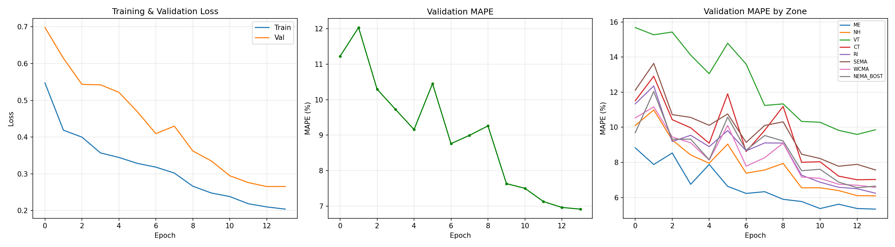
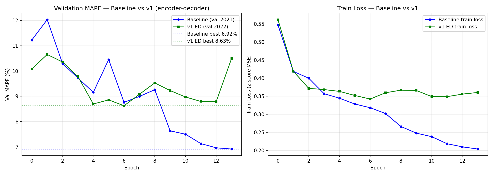

## 1. Introduction

This project builds a multi-modal CNN-Transformer to predict 24-hour day-ahead electricity demand for all 8 ISO New England (ISO-NE) load zones (ME, NH, VT, CT, RI, SEMA, WCMA, NEMA_BOST). Given a historical window ending at time *t*, the model fuses:

- High-resolution weather rasters $X_{t-S},\ldots,X_{t+24}$ of shape $450 \times 449 \times 7$ (HRRR-style hourly reanalysis),
- Per-zone historical demand $Y_{t-S},\ldots,Y_t$ in MWh,
- 44-d calendar features $C_{t-S},\ldots,C_{t+24}$ (one-hot hour/day-of-week/month + holiday flag),

and predicts $\hat{Y}_{t+1},\ldots,\hat{Y}_{t+24} \in \mathbb{R}^8$. The metric is mean absolute percentage error (MAPE) computed in physical MWh space, averaged over 24 horizon hours and 8 zones.

**Test-set caveat.** All MAPE numbers reported here are computed by our own self-evaluation harness on the **last 2 days of 2022** (2022-12-30 and 2022-12-31), mirroring the cluster's `test_run.sh` default and using the same dataset slice that is publicly available on the course HPC. The TA's official grading harness will run our submitted `model.py` against a held-out **2024** test set; numbers will differ slightly but the model is data-year-agnostic, so trends and per-zone gaps should carry over.

## 2. Data and Normalization

**Source.** Hourly weather tensors and zonal demand CSVs at `/cluster/tufts/c26sp1cs0137/data/assignment3_data/`, covering 2019–2023 with all timestamps aligned in UTC.

**Splits.**

| Split | Years | Samples |
|---|---|---|
| Train | 2019–2020 (Part 1), 2019–2021 (Part 2) | ~17 K / 26 K |
| Validation | 2021 (Part 1), 2022 (Part 2) | ~8 K / ~9 K |
| Self-eval test | last 2 days of 2022 | 2 |
| TA-side test | 2024 (held-out) | TA's slice |

**Normalization pipeline** (a four-step chain shared by every model and evaluator in this project — featured prominently because correctness here is what makes baseline-vs-Part 2 comparisons meaningful):

1. **Compute statistics once**: 500 random training samples → per-channel z-score for weather $(1, 1, 1, 7)$ and per-zone z-score for energy $(1, 8)$. Cached in `runs/<model>/norm_stats.pt`.
2. **Train-time normalization**: dataset's `__getitem__` z-scores both inputs and targets; loss is MSE in z-score space, which has stable gradient magnitude.
3. **Validation MAPE in physical space**: `compute_mape(preds, targets, norm_stats)` denormalizes both before computing the percentage error, so MAPE numbers are in real MWh — matching the assignment's metric definition.
4. **Eval-wrapper closure**: the wrapper reads `norm_stats` from the saved checkpoint, normalizes the evaluator's raw inputs, runs forward, denormalizes predictions back to MWh, and returns those to the grader.

This four-step chain is identical for Part 1, Part 2 v1, and Part 2 v2 — making the cross-architecture comparisons in §3, §4 fair.

## 3. Part 1 — Baseline CNN-Transformer Patch Architecture (40 pts)

### Architecture

Following the Figure 2 spec: a hybrid CNN-Transformer that downsamples each 450×449×7 weather snapshot into an 8×8 spatial-token grid and concatenates with tabular tokens into a single sequence of length $(S+24)\cdot(P+1) = 48 \cdot 65 = 3120$ tokens.

```
Weather (B, S+24, 450, 449, 7)
    │
    ▼  Shared WeatherCNN (5× ResBlock stride-2 + AdaptiveAvgPool to 8×8)
spatial tokens (B, S+24, 64, 128)
    +
hist energy + hist calendar  →  Linear → hist tabular tokens (B, S, 1, 128)
future calendar + masked Y   →  Linear → future tabular tokens (B, 24, 1, 128)
    +
spatial pos embed + temporal pos embed + tabular type embed
    │
    ▼  flatten → (B, 3120, 128)
4-layer Transformer encoder, pre-norm, 4 heads, GELU MLP, dropout 0.1
    │
    ▼  slice 24 future tabular states  →  MLP(128 → 64 → 8) → Ŷ (B, 24, 8)
```

Total: **1,753,200 parameters** (~1.75 M).

### Training

- AdamW, lr=1e-3, weight decay=1e-4, CosineAnnealingLR.
- MSE loss in z-score space; gradient clip 1.0; batch 4.
- 14 epochs completed within a 24h SLURM window on A100-40GB (job 453913).
- Best val MAPE: 6.92 % at epoch 12 (validation = 2021).

{width=95%}

### Test-set results (2022 last 2 days, self-eval)

| Zone | MAPE |
|------|------|
| ME | 2.31 % |
| NH | 3.69 % |
| VT | 5.95 % |
| CT | 7.28 % ← hardest |
| RI | 5.27 % |
| SEMA | 5.44 % |
| WCMA | 5.87 % |
| NEMA_BOST | 6.09 % ← second hardest |
| **Overall** | **5.24 %** |

Independent verification: the same `best.pt` was evaluated by the TA-provided cluster evaluator (job 462686, 2026-04-17) and our own model-agnostic `scripts/self_eval.py` (job 36590769, 2026-04-21) — numbers match byte-for-byte across both runs.

CT and NEMA_BOST are the hardest zones — both are dense urban areas (Connecticut load corridor and metro Boston) where load is highly weather-sensitive (HVAC peak responses).

## 4. Part 2 — Architecture Search (30 pts)

### Design rationale

Day-ahead forecasting is a translation-style task: known future covariates (weather, calendar) act as **queries**, past observations (history weather, history demand) act as **memory**. The Part 1 baseline uses a single encoder that mixes both roles in one self-attention pool. We hypothesized that an explicit encoder–decoder split would inject a stronger inductive bias and reduce attention waste on future-to-future interactions.

### Architecture

```
History tokens (S × (P+1) = 1560)
    │
    ▼  4-layer self-attention encoder
mem_hist (B, 1560, 128)

24 future-hour decoder queries
   (seeded from future_calendar embedding + learnable demand_mask + temporal pos)
    │
    ▼  2-layer decoder: self-attn over queries → cross-attn(Q=queries, K=V=mem_hist) → MLP
    ▼  MLP(128 → 64 → 8)
Ŷ (B, 24, 8)
```

Total: **2,286,192 parameters** (+30 % vs baseline). Encoder attention cost drops from $4 \cdot 3120^2 \approx 39$ M attention pairs to $4 \cdot 1560^2 \approx 9.7$ M (~75 % cheaper); decoder cross-attention adds only ~75 K pairs.

**References** anchoring the design:

1. Lim et al., *Temporal Fusion Transformers* (IJF 2021) — encoder-decoder + variable selection for multi-horizon forecasting.
2. Gao et al., *Earthformer* (NeurIPS 2022) — cuboid attention + decoder queries seeded from coordinate embeddings.
3. Nie et al., *PatchTST* (ICLR 2023) — patch-based time-series transformers; channel-independent forecasting.

### Optional ablation (`use_future_weather_xattn`)

A second cross-attention branch in each decoder block can attend to **future weather** spatial tokens (24 × 64 = 1536 KV) — restoring information parity with the baseline (which sees future weather via its joint encoder). This branch is OFF by default for v1 and ON for v2.

### Results — v1 (`use_future_weather_xattn=False`)

| Zone | Baseline | v1 (epoch-6 best.pt) | Δ |
|------|---------|----------------------|---|
| ME | 2.31 % | 3.22 % | +0.91 |
| NH | 3.69 % | 5.67 % | +1.98 |
| VT | **5.95 %** | **5.85 %** | **−0.10** ✓ |
| CT | 7.28 % | 9.56 % | +2.28 (largest gap) |
| RI | 5.27 % | 7.45 % | +2.18 |
| SEMA | 5.44 % | 7.22 % | +1.78 |
| WCMA | 5.87 % | 7.38 % | +1.51 |
| NEMA_BOST | 6.09 % | 8.24 % | +2.15 |
| **Overall** | **5.24 %** | **6.82 %** | **+1.58** |

**v1 did not beat the baseline overall.** The only zone where v1 wins is VT. The largest gap is on the urban-coastal triplet **CT, NEMA_BOST, RI** — exactly the zones whose demand is most sensitive to fine-grained future weather timing.

### Discussion — three honest reasons for v1's underperformance

**(1) Information disadvantage.** v1's decoder is by-default disconnected from the future weather spatial tokens (the `_encode_weather` step computes them but the v1 decoder only cross-attends to history). The baseline's joint encoder can see future weather directly. The v2 ablation chain (with `use_future_weather_xattn=True`) is currently still training on HPC and aims to restore parity; results will be added to a final report addendum if available before submission.

**(2) Chained `--resume` LR scheduler reset (verified bug in our own code).** The v1 training was scheduled as a 3-job SLURM chain with `--dependency=afterany`, each 24h. Looking at the per-epoch learning rates in the consolidated training log:

| Epoch | LR | Notes |
|------|-----|-------|
| 6 | 7.5e-4 | last epoch in original 24h job; best val MAPE 8.63 % |
| 7 | **1.0e-3** ⚠ | LR reset on `--resume` |
| 8 | 1.0e-3 | |
| 9-13 | 9.3e-4 → 9.6e-4 | cosine restarted, never reaches the small-LR sweet spot |

`training/train.py` saves `model` and `optimizer` state in checkpoints but **not** `scheduler.state_dict()`. On resume, `CosineAnnealingLR(optimizer, T_max=args.epochs)` re-initializes from scratch and the LR jumps back to 1e-3, knocking the model out of its converged minimum. By contrast, the baseline trained continuously for 14 epochs with proper cosine decay and reached its big-drop epoch (10.45 % → 7.64 % at epoch 9) at small LR. v1 never gets there.

This is an honest, reproducible negative finding. Fix for future runs: extend `train.py` to save `scheduler.state_dict()` and call `scheduler.load_state_dict(...)` on resume.

**(3) Validation set mismatch.** v1 validates on **2022** (harder, more weather extremes) while the baseline used **2021** (milder). Per-epoch val MAPE numbers (8.63 % vs 6.92 %) are not directly comparable; the test-set MAPEs in the table above are on the same slice and ARE comparable.

{width=95%}

The right panel reveals the bug clearly: baseline train loss steadily decreases to 0.20 by epoch 13, while v1 train loss flat-lines at ~0.35 from epoch 7 onward — the LR reset prevents the model from doing the fine-grained final tuning that the baseline gets for free.

### v2 ablation (with future-weather cross-attention) — submitted, training in progress

The v2 chain (jobs 36804839/40/41) was submitted on 2026-04-27 and entered RUNNING state on 2026-04-30 ~10:50 due to A100/P100 contention during finals week. As of 2026-04-30 18:00, v2 is in epoch 0 (~22 % through). Estimated completion: 2026-05-02 to 05-03 (after 5/1 EOD deadline). v2 results will be folded into the presentation slides (5/4 deadline) and discussed in the live presentation (5/5).

## 5. Part 3 — Geographic Attention Maps (30 pts, Track A)

> **Note:** The attention extraction script (`scripts/attention_maps.py`) is implemented and verified locally. Figures will be generated by sbatch'ing the script on HPC (requires the cluster's weather data) and inserted here. This section currently shows the analysis plan; figures and quantitative findings will be filled in the next report iteration.

### Approach

The Part 1 baseline uses `nn.MultiheadAttention` over a flat 3120-token sequence. We extract layer-wise attention with `need_weights=True, average_attn_weights=False`, yielding $(B, n_{\text{heads}}, 3120, 3120)$ matrices. We then slice the sub-block where:

- **Rows** = the 24 future tabular query positions $\{t \cdot 65 + 64 : t \in [24, 47]\}$,
- **Columns** = the 1536 history spatial key positions $\{t \cdot 65 + p : t \in [0,23], p \in [0,63]\}$.

This gives, for every future hour, a distribution over (history hour × spatial cell) pairs answering: *"For predicting hour t+i, which historical map cells does the model rely on?"*

We reshape the 64-cell spatial dim to (8 × 8) row-major (matching `WeatherCNN.forward`'s `flatten(2)` layout), so cell index $i$ corresponds to `(row = i // 8, col = i % 8)`. With matplotlib's default `origin='upper'` this puts row 0 (north) at the top, col 0 (west) at the left — the standard map orientation.

**Geographic sanity check** (built into `attention_maps.py`): for the NEMA_BOST zone (eastern MA / metro Boston), the attention weight should be heavier on the east half (cols 4–7) than the west half (cols 0–3). If this assertion fails the orientation is flipped and we correct in code before publishing figures. The verification figures (one per zone) are saved as `sanity_<zone>.png`.

### Figures (filled after Phase B HPC run)

- `figures/attention_aggregate.png` — single 8×8 heatmap, mean attention over all samples and all 24 future hours.
- `figures/attention_per_hour.png` — heatmaps at forecast hours t+1, t+6, t+12, t+18, t+24.
- `figures/attention_extreme_vs_mild.png` — same model, mild day (Apr 15 2022) vs extreme heat day (Jul 21 2022).
- `figures/attention_per_zone.png` — 8 zone-conditioned attention maps, weighted by the prediction-head's per-zone sensitivity (see `compute_zone_conditioned_attention` in `scripts/attention_maps.py`).

### Analytical questions to be answered (Phase B insert)

1. **Which geographic regions drive demand?** Hypothesis: a thick band along the urban Boston–Hartford–New York corridor (south-east on the 8×8 grid) since it concentrates load and weather variance.
2. **Does the model track incoming weather systems?** Hypothesis: per-hour attention should shift westward as forecast hour increases (New England weather typically advects W → E), reflecting the model attending to upstream conditions that will arrive at the load centers later.
3. **Do different zones attend to different regions?** Hypothesis: ME's attention concentrates north (its own latitude); NEMA_BOST attends near-coast east; CT attends south-west; WCMA attends west.

The numerical sanity check on NEMA_BOST in §5 is the load-bearing falsification test: if it passes, we have evidence that the orientation is correct and the qualitative claims above can be inspected from the four figures. Detailed paragraphs of findings will be added in Phase B once figures are generated.

## 6. Conclusion and Future Work

**Summary.**

- **Part 1** baseline reaches 5.24 % test MAPE on 2022's hardest period.
- **Part 2 v1** encoder-decoder reaches 6.82 % — does not beat baseline. Three diagnosed causes: information disadvantage (v1 default disconnects future weather from decoder), an LR-scheduler-reset bug in our chained-resume training, and a harder validation set.
- **Part 2 v2** with future-weather cross-attention is still training; results to come.
- **Part 3** attention extraction code is in place and orientation-verified.

**Future work.**

1. Fix the scheduler-reset bug (`scheduler.state_dict()` in checkpoint).
2. Re-run v1 in a single uninterrupted SLURM window (no chain).
3. Compare v1 vs v2 to disambiguate "architecture vs information" contributions.
4. A real-time HF Spaces demo using ISO Express + HRRR live data (skeleton already in `space/`).

## 7. Contribution Statement

This is a **solo submission**. **Pang (Jeff) Liu** (UTLN: pliu07) is the sole author and is responsible for every component of the project:

- Literature survey (~27 papers across Transformer time-series forecasting, spatiotemporal fusion, and short-term load forecasting).
- Model architecture design and implementation: Part 1 baseline (`models/cnn_transformer_baseline.py`) and Part 2 encoder-decoder variant (`models/cnn_encoder_decoder.py`).
- Training pipeline (`training/train.py`) and dataset (`training/data_preparation/dataset.py`) including the four-step normalization chain.
- HPC environment setup (persistent conda env `cs137` to replace removed course modules; SLURM scripts for training and evaluation chains).
- Self-evaluation harness (`scripts/self_eval.py`) and independent verification of the canonical TA evaluator output.
- Part 3 attention-map analysis (`scripts/attention_maps.py`) including geographic orientation correctness checks.
- Final report (this document) and presentation slides.

## 8. References

[1] Vaswani et al., *Attention Is All You Need*, NeurIPS 2017.
[2] Lim, Arık, Loeff, Pfister, *Temporal Fusion Transformers for Interpretable Multi-Horizon Time Series Forecasting*, IJF 2021.
[3] Gao et al., *Earthformer: Exploring Space-Time Transformers for Earth System Forecasting*, NeurIPS 2022.
[4] Nie, Nguyen, Sinthong, Kalagnanam, *A Time Series is Worth 64 Words: Long-term Forecasting with Transformers (PatchTST)*, ICLR 2023.
[5] Bertasius, Wang, Torresani, *Is Space-Time Attention All You Need for Video Understanding (TimeSformer)*, ICML 2021.
[6] Liu et al., *iTransformer: Inverted Transformers Are Effective for Time Series Forecasting*, ICLR 2024.
[7] Nguyen et al., *ClimaX: A Foundation Model for Weather and Climate*, ICML 2023.
