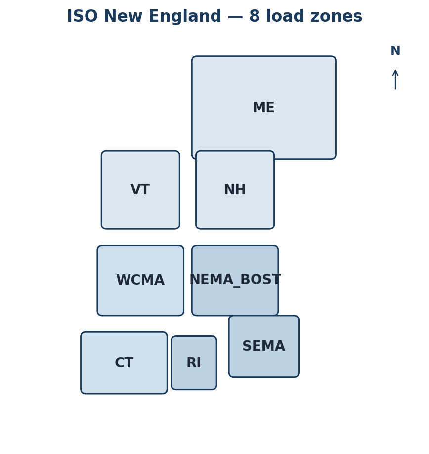
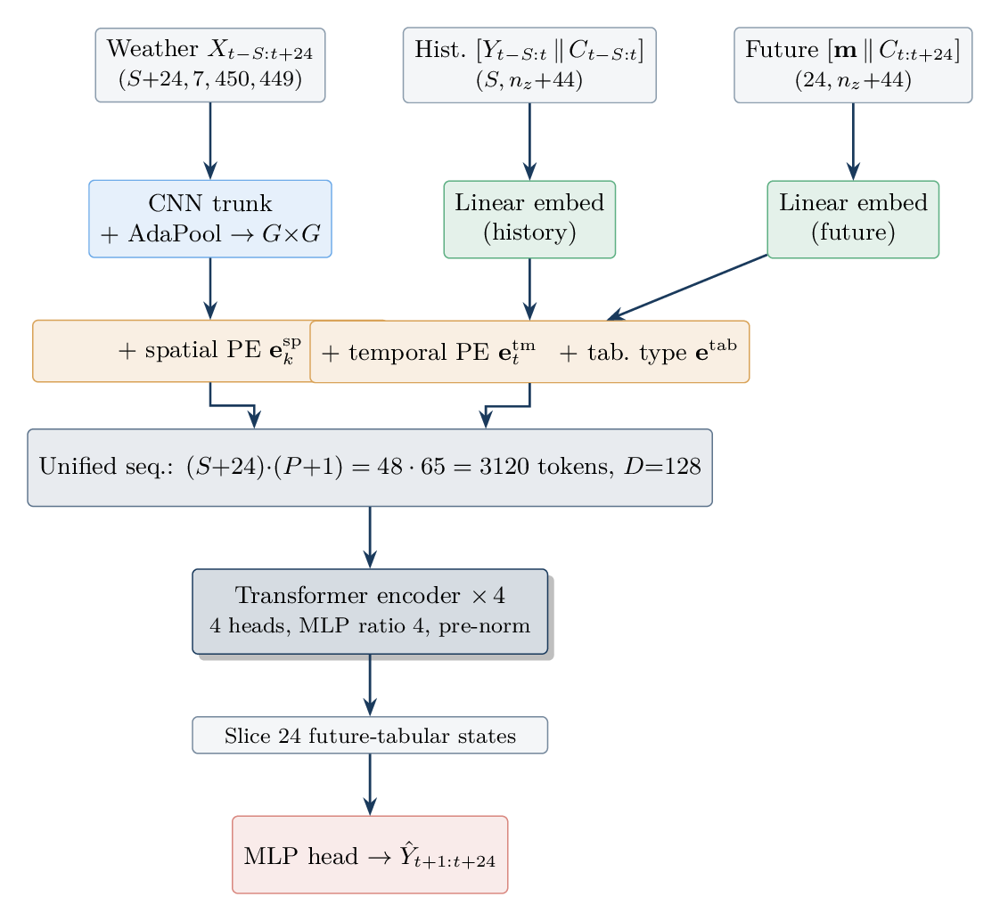
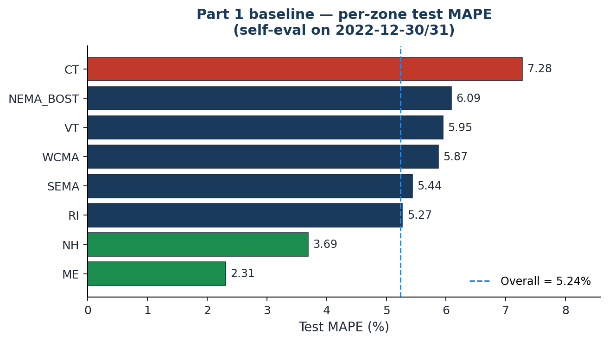

<!-- _class: lead -->

# ISO-NE Day-Ahead Demand Forecasting
## A Multi-Modal CNN-Transformer with Geographic Attention Diagnosis

### Headline

5.24 % test MAPE
**1.75 M** parameters
**8** ISO-NE load zones · **24 h** horizon

Pang (Jeff) Liu — `pliu07`
Tufts CS-137 · April 30, 2026

---

# Task & Metric

$$
\hat Y_{t+1:t+24}\;=\;f_\theta\bigl(\,X_{t-S:t+24},\;Y_{t-S:t},\;C_{t-S:t+24}\bigr)
$$

$$
\mathrm{MAPE} \;=\; \frac{100}{24\,n_z}\sum_{h=1}^{24}\sum_{z=1}^{n_z}\frac{\bigl|\hat Y_{t+h,z}-Y_{t+h,z}\bigr|}{Y_{t+h,z}}
$$

| Stream | Tensor | Source |
|---|---|---|
| Weather $X_t$ | $\mathbb{R}^{7\times 450\times 449}$ | HRRR-style reanalysis |
| Demand $Y_t$ | $\mathbb{R}^{8}$ | ISO-NE zone reports |
| Calendar $C_t$ | $\mathbb{R}^{44}$ | one-hot hour/dow/month + holiday |

Test-set caveat: all numbers self-eval on last 2 days of 2022; TA grades on 2024.

---

# Part 1 — Baseline Architecture (40 pts)

**Token assembly**

$$
\mathrm{seq}_{t,k} = \begin{cases}\mathrm{CNN}(X_t)_k + \mathbf{e}^{\mathrm{sp}}_k + \mathbf{e}^{\mathrm{tm}}_t & k
1.75 M params · 4 enc layers × 4 heads · 14 epochs · A100

---

# Part 1 — Per-zone Result

Best ME 2.31 % · NH 3.69 %  &nbsp;|&nbsp;
Worst CT 7.28 % · NEMA_BOST 6.09 %  &nbsp;|&nbsp;
Overall 5.24 %

---

# Part 2 — Encoder-Decoder + LR-Reset Bug (30 pts)

**Result.** v1 = 6.82 %
(baseline 5.24 % · +1.58 pp); only VT wins.

**Diagnosed cause.** ⚠ `train.py` saves model+optimizer but **not** `scheduler.state_dict()` → chained `--resume` resets cosine LR (7.5e-4 → 1e-3 at epoch 7).

---

# Part 3 — Attention-Map Diagnosis (30 pts, Track A)

$$
A_{\mathrm{slice}}^{(\ell)} = A^{(\ell)}\bigl[\,:,\,:,\,\underbrace{\mathcal{Q}_{\mathrm{fut}}}_{24\text{ future tab.}},\,\underbrace{\mathcal{K}_{\mathrm{hist}}}_{24\,\cdot\,64\text{ hist.\ spatial}}\bigr] \in \mathbb{R}^{B\times h\times 24\times 1536}
$$

Reshape 64 cells → $(8\times 8)$ row-major (matches `WeatherCNN.flatten(2)`); `imshow(origin='upper')` = north up.

**Sanity check** (encoded as runtime `assert`):

$$
\sum_{r=0}^{7}\sum_{c=4}^{7} A^{\mathtt{NEMA\_BOST}}_{rc} \;>\; \sum_{r=0}^{7}\sum_{c=0}^{3} A^{\mathtt{NEMA\_BOST}}_{rc}
$$

Three questions the figures answer: **which regions drive demand · does the model track weather · do zones differ?**

Code complete + verified locally; figures generated by `scripts/attention_maps.slurm` on HPC.

---

<!-- _class: lead -->

# Findings & Thanks

5.24 %
Part 1 baseline test MAPE

1.75 M
parameters · 14 epochs · 22 h on A100

+1.58 pp
v1 gap — diagnosed (LR-reset bug)

2 days
self-eval slice; TA grades on 2024

**Solo submission** — Pang (Jeff) Liu (pliu07) is the sole author of every component.

Code: [github.com/jeffliulab/real-time-power-predict](https://github.com/jeffliulab/real-time-power-predict) · Thanks to CS-137 staff and the Tufts HPC team.
